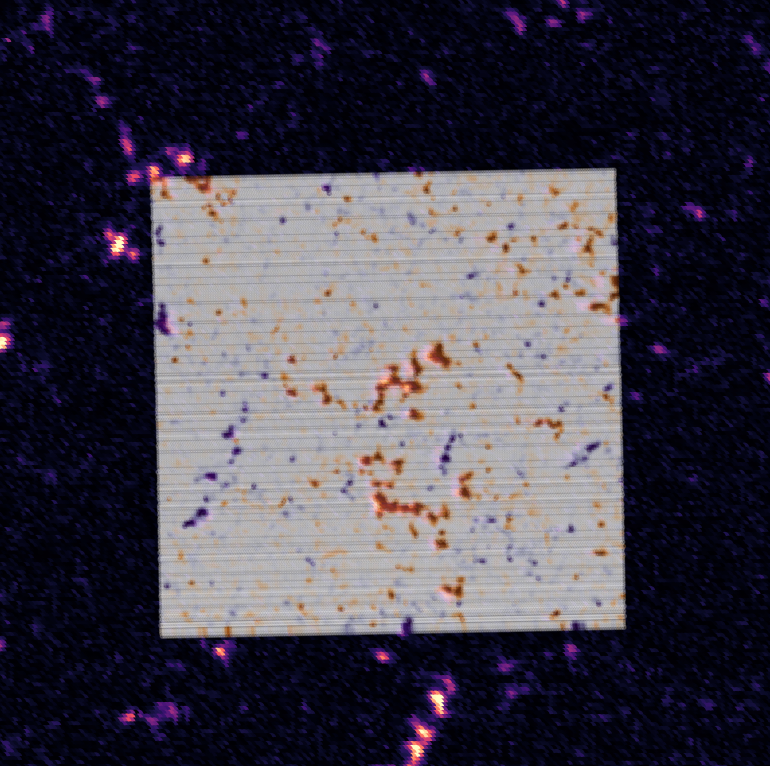

# hmi_hinode_alignment
A code for determining the helio-projective (HP) coordinates of Hinode magnetograms using co-temporal HMI magnetograms.

---
## General Overview
We upscale HMI data to Hinode's resolution by interpolating HMI onto an irregular grid of HP coordinates, and cross-correlating the interpolated HMI magnetograms with the Hinode observations. 

Although other codes exist for this problem, we were interested in writing one with a few differences in mind:

1. Using multiple HMI 45s vector magnetograms:
   - Hinode rasters are observed as slit scans over a time extent, usually ~15 minutes. This means that multiple HMI scans are taken during any given Hinode dataset, and the real Sun is changing over the Hinode observations.
   - To be as accurate as possible, we interpolate from the closest HMI map to each slit to build up an artificial upscaled HMI magnetogram made up of multiple 45s HMI magnetograms.

2. Finding the best alignment for 5 different parameters:
   - We're interested in aligning Hinode datasets to < 0.3" accuracy.
   - To find HP coordinates for Hinode datasets this accurately, we use 5 different alignment parameters:
     1. $x_{cen}$: offset of the x center of the Hinode dataset, in arcseconds
     2. $y_{cen}$: offset of the y center of the Hinode dataset, in arcseconds
     3. $\theta$: roll angle correction, measured CCW from solar North 
     4. $\delta_x$: a multiplier offset to correct for the spacing of x-coordinates   
     5. $\delta_y$: a multiplier offset to correct for the spacing of y-coordinates (here, we're assuming the spacing in x and y are constant, but may be the wrong spacing from the Hinode header)

A work-in-progress. Contact: james.crowley (at) colorado.edu